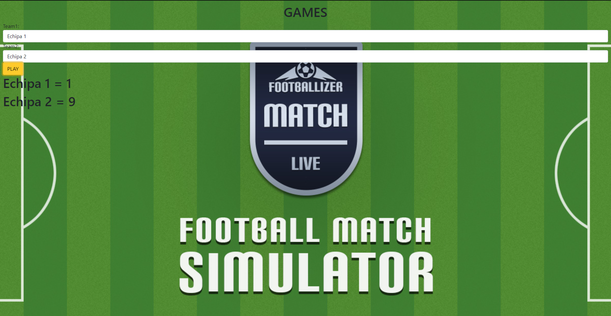
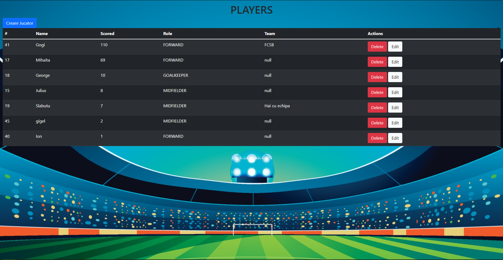
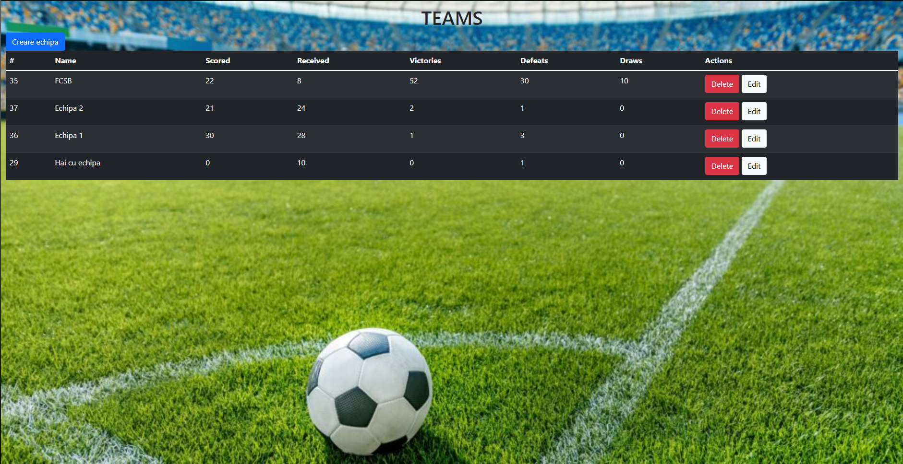

# NRO-SummerCamp

It was a great experience in the summer camp at NetRom.
The goal of this boot camp is to teach participants everything they need to know for a backend developer job.
We worked in Java Spring, and the database was made in SQL. During the three-week practice period, we had to create an application that organizes football
competitions. It was a very challenging project, which aimed to go through all the stages
necessary to realize a backend project.
Here are some images of what I managed to create

